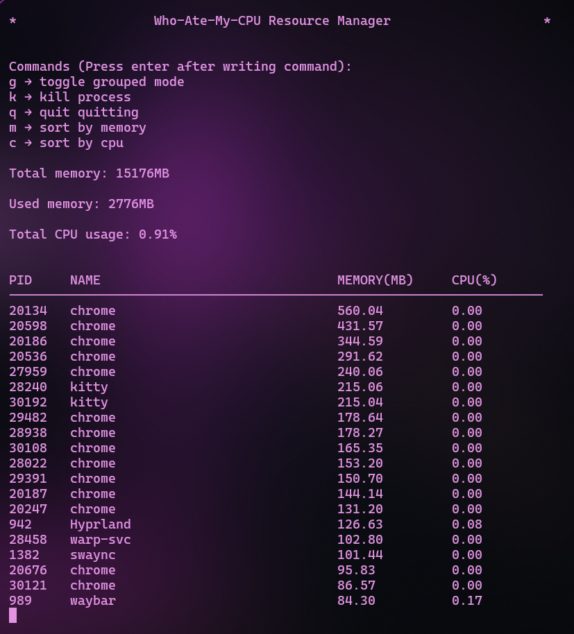

# Who-Ate-My-CPU

Who-Ate-My-CPU is a simple terminal-based process manager written in Python.  
It reads information from the Linux `/proc` filesystem and displays running processes along with their memory and CPU usage. It also allows grouping processes and terminating them directly from the terminal.

This project was mainly built as a learning exercise to explore how Linux exposes system and process information through `/proc`, and to better understand how processes work internally.

A short demo of the program can be found here:

## Features

- Display running processes with **PID, name, memory usage, and CPU usage**
- **Dynamic refreshing** of system statistics
- **Grouped mode** to aggregate processes with the same name
- **Sort processes** based on memory usage
- **Terminate processes** by PID or by name

## Requirements

- Python 3
- Linux system (the program relies on the `/proc` filesystem)

## How to Run

Clone the repository and run the program:

git clone <repo-url>
cd Who-Ate-My-CPU
python3 main.py
Demo

## Learning Outcomes

The goal of this project was not to build a full system monitor, but to better understand some fundamentals of Linux.

While working on it, I explored:

The structure and purpose of the /proc directory

How Linux exposes process information through files like status, stat, and meminfo

How CPU usage can be calculated using system ticks

How memory usage is tracked for individual processes

Interacting with running processes using signals

Overall, this project helped me get a clearer understanding of how Linux manages processes and exposes system information through the filesystem.
